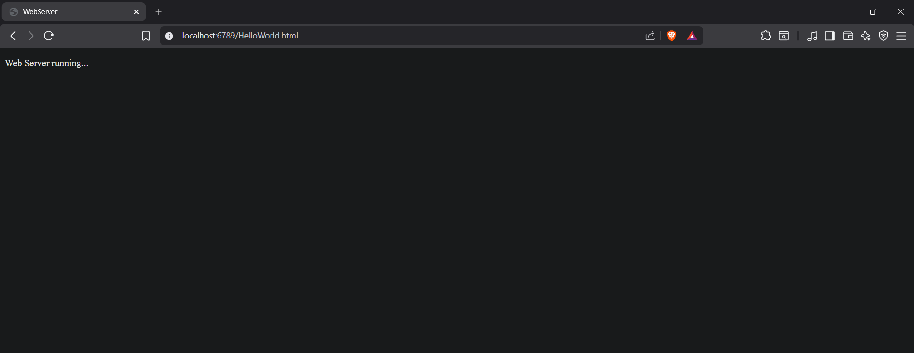
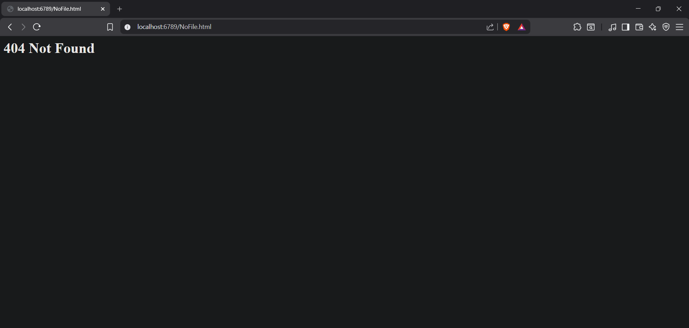

# Web Server Python Lab  

## Overview
This lab implements a simple HTTP web server that can serve HTML files and return 404 errors for missing files.

## Code Explanation

```python
serverSocket.bind(('', 6789))
serverSocket.listen(1)
```
- **bind()**: Binds the socket to port 6789 on all available network interfaces (empty string '' means all interfaces)
- **listen(1)**: Tells the socket to listen for incoming connections, with a maximum of 1 queued connection

```python
connectionSocket, addr = serverSocket.accept()
```
- **accept()**: Waits for an incoming connection and returns:
  - `connectionSocket`: A new socket object for communicating with the client
  - `addr`: The address of the client

```python
message = connectionSocket.recv(1024).decode()
```
- **recv(1024)**: Receives up to 1024 bytes from the client
- **decode()**: Converts the received bytes to a string

```python
outputdata = f.read()
```
- **read()**: Reads the entire content of the opened file

```python
connectionSocket.send("HTTP/1.1 200 OK\r\n\r\n".encode())
```
- Sends an HTTP 200 OK response header
- **\r\n\r\n**: Two newlines indicate the end of headers
- **encode()**: Converts the string to bytes for transmission

```python
connectionSocket.send("HTTP/1.1 404 Not Found\r\n\r\n".encode())
connectionSocket.send("<html><head></head><body><h1>404 Not Found</h1></body></html>\r\n".encode())
```
- Sends a 404 error header followed by an HTML error page

```python
connectionSocket.close()
```
- Closes the connection with the client after sending the error response

## How to Run

### Step 1: Prepare Files
1. Save `webserver.py` and `HelloWorld.html` in the same directory
2. Make sure both files are in the same folder

### Step 2: Find Your IP Address

**Windows:**
```bash
ipconfig
```
Look for "IPv4 Address"

**Mac/Linux:**
```bash
ifconfig
# or
hostname -I
```

### Step 3: Start the Server
```bash
python webserver.py
```
You should see: `Ready to serve...`

### Step 4: Test from Browser
Open a browser and navigate to:
```
http://YOUR_IP_ADDRESS:6789/HelloWorld.html
```

For example:
```
http://192.168.1.100:6789/HelloWorld.html
```

### Screenshot


**Testing locally (on the same machine):**
```
http://localhost:6789/HelloWorld.html
# or
http://127.0.0.1:6789/HelloWorld.html
```

### Step 5: Test 404 Error
Try to access a file that doesn't exist:
```
http://localhost:6789/DoesNotExist.html
```
You should see the "404 Not Found" message.

### Screenshot


## Key Concepts

### HTTP Request Format
When you request a file, the browser sends:
```
GET /HelloWorld.html HTTP/1.1
Host: localhost:6789
...other headers...
```

### HTTP Response Format
The server responds with:
```
HTTP/1.1 200 OK

<html content here>
```

### Port Numbers
- **Port 6789**: Custom port used in this lab
- **Port 80**: Default HTTP port (if you omit :6789 in URL, browser assumes port 80)

## Troubleshooting

### File not found even though it exists
- Make sure the HTML file is in the same directory as the Python script
- Check for typos in the filename (case-sensitive on Linux/Mac)
- The file path in the URL should NOT include the leading slash used in the code

